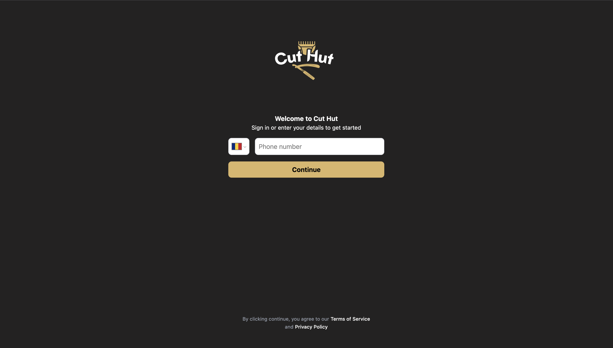
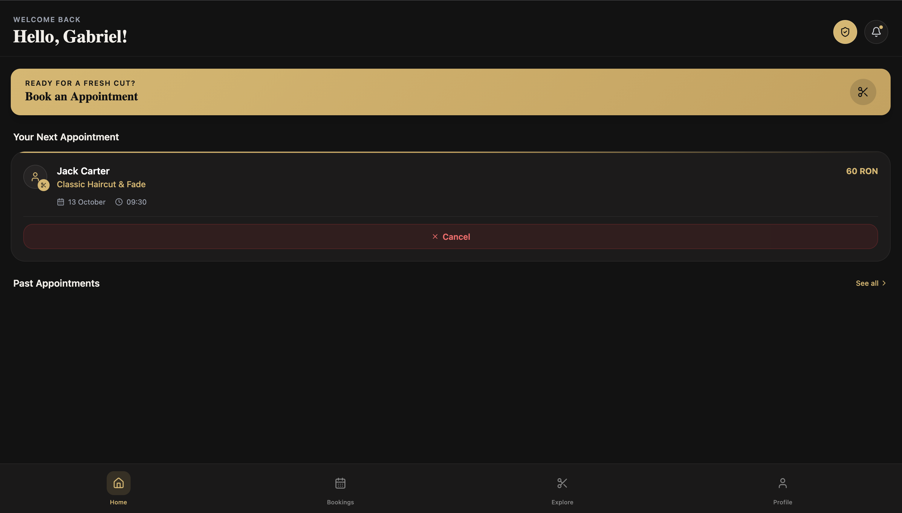
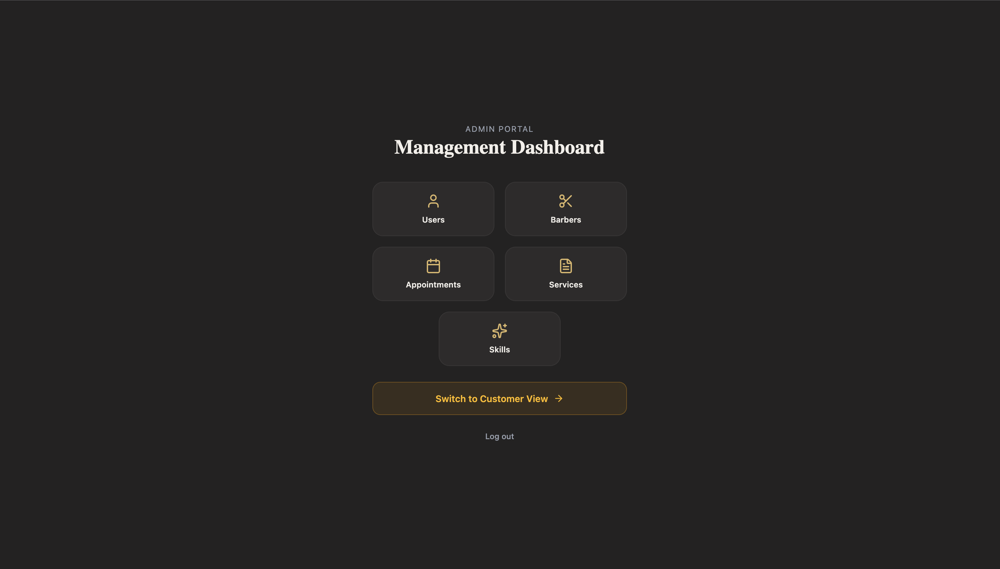
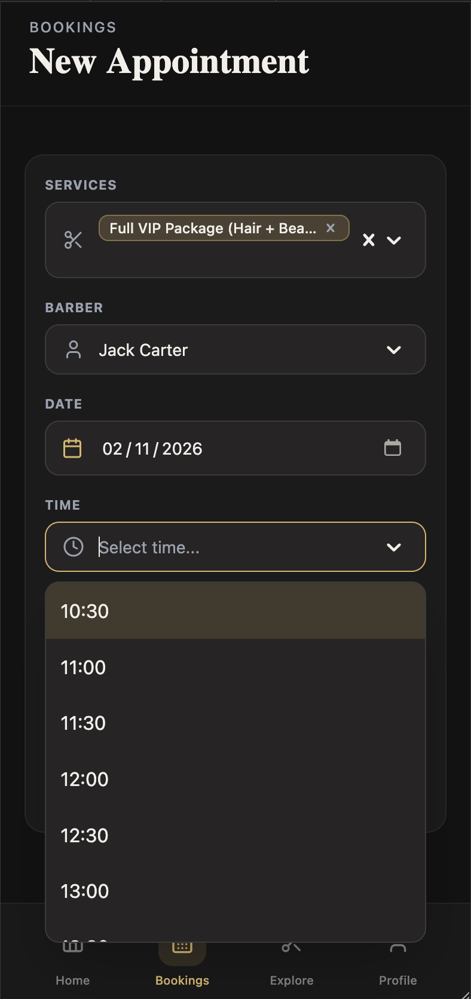

# CutHut - Barbershop Appointment Management

CutHut is a full-stack web application for managing barbershop appointments, customers, barbers, services, and notifications.

The project is currently an MVP developed as a student portfolio project and will continue to evolve as part of the bachelor's degree project.

## Live Demo

- Frontend: https://barbershop-schedule.vercel.app
- Backend health check: https://cut-hut.onrender.com/api/system/health

## Screenshots

### Welcome screen



### Customer dashboard



### Admin dashboard



### Appointment booking



## Demo

A short walkthrough of the main customer flow: account creation, appointment booking, appointment cancellation, and logout.

[Watch the demo video](docs/demo/cuthut-demo.mov)

## Features

- Phone authentication using OTP
- Role-based access control (RBAC) for customers, barbers, and administrators
- Appointment booking with real-time availability and conflict prevention
- Barber and service management
- Skills and service compatibility
- In-app notifications
- Responsive desktop and mobile interface
- PostgreSQL database integration
- Rate limiting and server-side logging

## Tech Stack

### Frontend

- React
- Vite
- Tailwind CSS
- React Router
- Supabase Auth

### Backend

- Node.js
- Express
- PostgreSQL
- Supabase
- Pino

### Deployment

- Vercel - frontend
- Render - backend
- Supabase - authentication and database

## Architecture

```text
React frontend (Vercel)
          |
          v
Express REST API (Render)
          |
          v
PostgreSQL database (Supabase)
```

## Run Locally

### Frontend

```bash
cd client
npm install
npm run dev
```

### Backend

```bash
cd server
npm install
node src/index.js
```

## Environment Variables

Create a `.env` file in both `client` and `server`.

Frontend variables:

```env
VITE_API_URL=
VITE_SUPABASE_URL=
VITE_SUPABASE_ANON_KEY=
VITE_SENTRY_DSN=
```

Backend variables:

```env
DB_HOST=
DB_PORT=
DB_NAME=
DB_USER=
DB_PASSWORD=

SUPABASE_URL=
SUPABASE_ANON_KEY=
SUPABASE_ROLE_KEY=

EMAIL_USER=
EMAIL_PASS=

TWILIO_ACCOUNT_SID=
TWILIO_AUTH_TOKEN=
TWILIO_PHONE_NUMBER=
```

Never commit `.env` files or private credentials.

## Project Status

The application is functional and publicly deployed as an MVP.

Planned improvements include:

- exploring machine learning features for demand forecasting and appointment optimization;
- expanding automated test coverage;
- improving mobile UI and accessibility;
- completing external notification integrations;
- adding stricter database security policies;
- continuing development as part of the bachelor's degree project.

## License

Copyright (c) 2026 Nechifor Ștefan-Eduard. All rights reserved.

This repository is published for portfolio review and educational demonstration.
The source code may not be copied, redistributed, commercialized, or submitted
as academic work without prior written permission.
